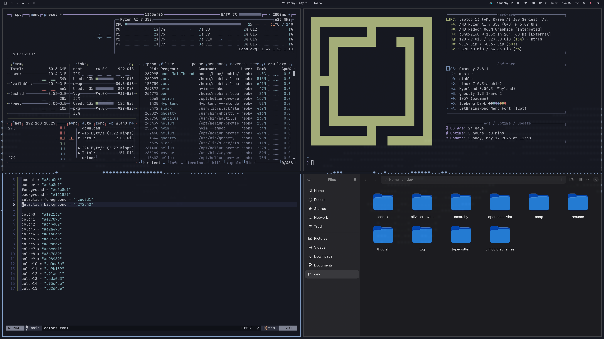

# `omarchy-iceberg-dark-theme`

`omarchy-iceberg-dark-theme` is a dark omarchy theme built around [`cocopon/iceberg.vim`](https://github.com/cocopon/iceberg.vim).



## Installation

```bash
omarchy-theme-install https://github.com/vimcolorschemes/omarchy-iceberg-dark-theme.git
```

## Usage

Select `iceberg-dark` from the omarchy theme picker, or apply it with:

```bash
omarchy-theme-set iceberg-dark
```
